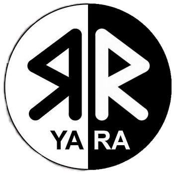
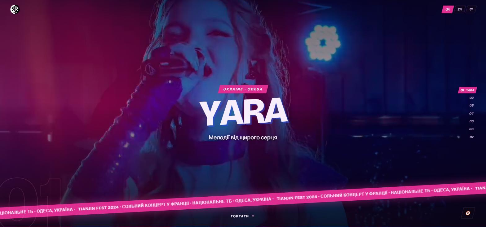
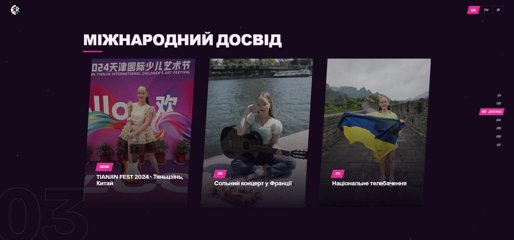
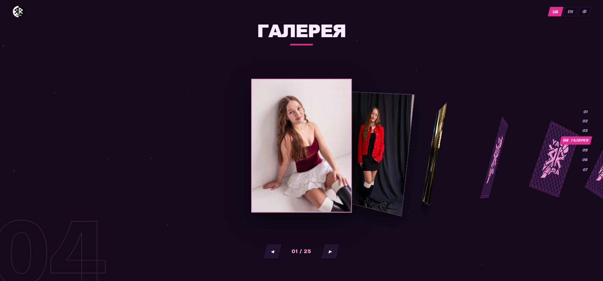
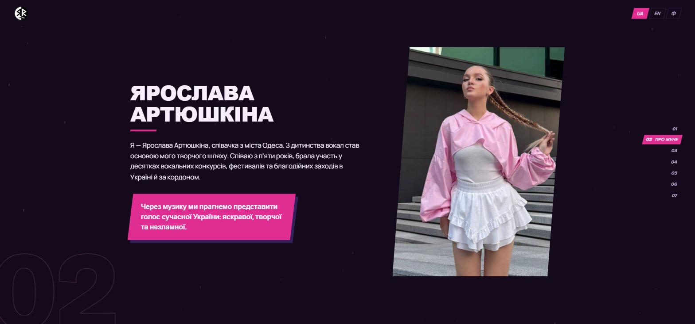

<div align="center">



# YARA

**An artist site built as a game, not a page.**

A single-page site for **YARA** (Ярослава Артюшкіна) — a Ukrainian vocalist from Odesa —
rebuilt as a seven-chapter fullscreen engine with a hand-rolled SVG wave transition,
a rotating card-deck gallery, and three languages. No framework. No build step. One dependency.

<sub>Vanilla JS · GSAP · SVG · CSS · ~1,900 lines</sub>

<br>

[](https://georgy-web-dev.github.io/yara-artist-site/)

<sub>Best on desktop — a wide screen with a mouse gets the full chapter engine.<br>
Phones and reduced-motion visitors get the scrolling fallback by design.</sub>

</div>

<br>

[](https://georgy-web-dev.github.io/yara-artist-site/)

<br>

## The idea

The client brief was one sentence: *"a game that pulls you in, not a regular page — visual
storytelling; we don't even need half the info."*

So the page doesn't scroll. It has **chapters**. Wheel, arrow keys, swipe, or the HUD rail on
the right move you between seven fullscreen screens, and every switch is covered by a wave that
washes across the viewport. Content that didn't earn its screen — team roster, stat counters,
languages line — was cut rather than shrunk.

| | Chapter | What it does |
|--|--|--|
| `01` | **Title** | Fullscreen stage video, title chars slam in with rotation, angled marquee of credentials |
| `02` | **Story** | Bio and a quote band that scales in from zero width |
| `03` | **World Tour** | Three level-select panels — Tianjin Fest 2024, France, national TV |
| `04` | **Gallery** | A 25-photo card deck you cycle through; cards rotate away as they recede |
| `05` | **Cutscenes** | Two music videos side by side |
| `06` | **Soundtrack** | Tracklist with honest `Coming soon` states — no fake player controls |
| `07` | **Contact** | Direct booking details |

<br>

## Two modes, decided before first paint

The engine is a liability on a phone and a hostile act for anyone with vestibular sensitivity.
So an inline `<head>` script picks a mode before anything renders, and stamps it on `<html>`:

```js
var game = window.matchMedia("(min-width: 961px) and (pointer: fine)").matches
  && !window.matchMedia("(prefers-reduced-motion: reduce)").matches;
document.documentElement.classList.add(game ? "mode-game" : "mode-flow");
```

**`mode-game`** — the chapter engine. Fullscreen screens, wave wipes, ambient dust, card deck.

**`mode-flow`** — the same seven chapters as ordinary scroll-snapped sections. The gallery
becomes a native horizontal snap strip. Wipes and dust are off. `IntersectionObserver` handles
reveals, with the default state *visible* so nothing is ever stuck invisible if JS dies.

Two more things fall back into flow mode: **GSAP failing to load from the CDN**, and crossing a
mode boundary at runtime (resize past 960px, or toggling reduced motion) — which reloads into
the correct mode rather than trying to hot-swap two very different engines.

<br>



<br>

## The wave

The chapter transition is the centrepiece, and it is built from scratch — four stacked SVG paths
redrawn every frame. No library, no video, no sprite sheet.

- **Edges from three sampled sine harmonics.** Each layer's crest is generated per frame from
  three superimposed sines whose phase is driven by the wave's travel position, so the lobes
  curl and churn as it moves instead of sliding a fixed shape across the screen.
- **Roughened by `feTurbulence`.** A fractal-noise `feDisplacementMap` breaks up the
  mathematical cleanliness of the sines so the edge reads as water, not as a curve.
- **Depth by layering.** Violet (depth) → pink (body) → froth → ink foam, each lagging the one
  behind it. Foam-spray droplets burst off the crest at the covered moment and again mid-recede.
- **The stagger reverses on exit** so the receding edge reads dark rather than flashing white.

The non-obvious part is the timing. Entrance timelines are created **at the covered moment**
with `immediateRender: true`, so every from-state applies while the screen is fully hidden. The
wave always recedes over content that is already animating — never over a finished frame. That
was the "page loads, *then* animates" bug, and building the timeline late is what killed it.
Initial page load reuses the same system: the wave starts fully covering and the preloader
vanishes behind it.

<br>



<br>

## The gallery deck

25 photos in one pile. The wheel cycles cards, and rotation progresses with distance from the
front — face-on, then 45°, then past-edge, then back-only — so the deck reads as physical depth
rather than a carousel. Non-front cards idle with a slight skewed sway. Card backs carry the
artist's own promo vector, tinted pink through a CSS mask over a hatched pattern. A second push
at the edge of the deck exits the chapter instead of dead-ending.

Clicking opens a keyboard-navigable, focus-trapped lightbox.

<br>

## Three languages, no i18n library

`js/i18n.js` is a flat object of `ua` / `en` / `ch` keyed by dotted paths, applied to
`[data-i18n]` nodes on switch. Ukrainian is the default — this is a Ukrainian artist — and
Chinese is there because Tianjin is a real part of her touring history, not an SEO play.

Typography had to carry all three: **Bricolage Grotesque** for display and **Manrope** for body,
both with genuine Cyrillic coverage, over a system CJK stack for `zh`.

<br>



<br>

## Accessibility

Not an afterthought on a site this motion-heavy:

- `prefers-reduced-motion` lands in flow mode — no wipes, no dust, no card fan, instant states.
- Body text resolves to `--ink` at 16px+ and clears 4.5:1 against the deep-plum base; the muted
  lilac is reserved for captions at ≥14px bold or ≥18px.
- Every gallery photo carries per-photo alt text, not filename-derived filler.
- The lightbox traps focus and is fully keyboard-navigable.
- Flow-mode reveals default to *visible* and are only hidden once the observer is armed.

<br>

## Design system

One hot signature colour does all the shouting; electric violet is its counterpart.

| Token | | Role |
|--|--|--|
| `--bg` | `#140a1c` | Near-black deep plum, the page base |
| `--surface` | `#221430` | Cards, panels, buttons |
| `--ink` | `#f8eefb` | Primary text, pink-tinted white |
| `--signature` | `#e02d92` | Hot pink — CTAs, active HUD, wave body, quote band |
| `--signature-light` | `#ff9fd6` | Highlights, card borders, dust particles |
| `--violet` | `#7a3df0` | Electric violet — wave depth, offset shadows |

Section backgrounds are diagonal feathered energy bands rotated ±5–7°, so they read as a fast
cut rather than the ambient blurred glow blobs every landing page ships with.

Full rationale, including the colour rounds that got rejected on the way here, lives in
[`docs/DESIGN.md`](docs/DESIGN.md) and [`docs/PRODUCT.md`](docs/PRODUCT.md).

<br>

## Run it

Nothing to clone, install, or build. It is already deployed and running:

<div align="center">

[](https://georgy-web-dev.github.io/yara-artist-site/)

<sub>Served from GitHub Pages straight off `main` — no pipeline, because there is nothing to compile.</sub>

</div>

<br>

## Structure

```
index.html          7 chapters + HUD + wave SVG + pre-paint mode script
css/style.css       design tokens, both modes, all chapter layouts
js/main.js          chapter engine, wave, deck, lightbox, dust, preloader
js/i18n.js          ua / en / ch strings
img/                stage photography, hero video, logo, promo vector
docs/               design and product rationale, screenshots
```

<br>

## Stack

Vanilla JS (one IIFE, `"use strict"`) · [GSAP 3.12](https://gsap.com/) from CDN, the only
dependency · hand-written SVG filters and paths · CSS custom properties, a `clamp()` type scale,
scroll-snap · `matchMedia` and `IntersectionObserver`.

Deliberately **not** used: a framework, a bundler, a CSS library, an i18n package, a carousel
plugin, a lightbox plugin, or a scroll-smoothing library. Lenis and ScrollTrigger were in an
earlier pass and were removed once game mode meant there was no scroll left to smooth.

<br>

## License

The **source code** is free to read and learn from.

The **media** — photography, video, the YARA logo and promo vector, the music, and all copy —
belongs to the artist and is **not** licensed for reuse.

<br>

---

<div align="center">
<sub>Built for a real client. Design and engineering by <a href="https://github.com/Georgy-web-dev">Georgy-web-dev</a>.</sub>
</div>
